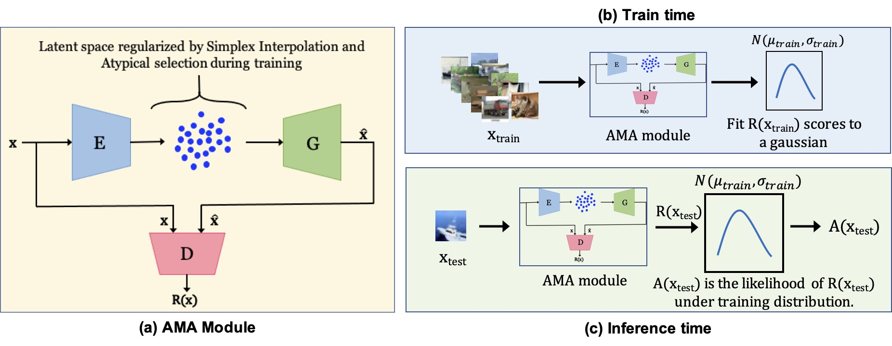

This repository is the official PyTorch implementation of Adversarial Mirrored Autoencoder. Find the paper on [arxiv](https://arxiv.org/abs/2003.10713). To appear in Uncertainty in Artificial Intelligence (UAI 2021).  

# Unsupervised Anomaly Detection with Adversarial Mirrored AutoEncoders

## Training

```
python train.py --recon_loss_type='wasserstein' --ae_recon_loss_type='wasserstein' --use_penalty --spectral_norm=1 --anom_recon_lambda=5 --regularizer_lambda=1 --anom_pc=0.1 --dataset='cifar10' --expt_name='cifar_experiments' --normal_class="['ship']" --sampling
```
For OOD experiments run
```
python train.py --recon_loss_type='wasserstein' --ae_recon_loss_type='wasserstein' --use_penalty --spectral_norm=1 --anom_recon_lambda=5 --regularizer_lambda=1 --anom_pc=0.1 --dataset='cifar10' --expt_name='cifar_experiments' --ood_model --sampling 
```

### Arguments

* ```--dataset``` - Currently works with CIFAR10. 
* ```--ood_model``` - Call this when you want to run OOD Anomaly Detection experiment.
* ```--sampling``` - Turn sampling on/off using this
* ```--atyp_selec_style``` - Which style sampling for anomalies. Options are 'inward|outward|sipple'
* ```--interpolation_in_recon``` - Turns on simplex interpolation in training 
* ```--corrup``` - Turn this on for corruption of training data. Use it along with ```--anom_pc``` to choose the level of corruption
* ```--anom_pc``` - If used without --corrup, it results in Semi-supervised learning.
* ```--normal_class``` - To select which class is normal in in-distribution AD experiments. Multiple classes can be selected.
* ```--nz``` - Size of the latent space variable. 128 for CIFAR10 expts.


### Requirements
* Python3.7 and the most recent pytorch.
* wandb installed and initialized to visualize the trends

### Results
The best model is chosen based on AUC on validation data. The test AUC and other information are outputted as summary parameter on wandb.

Other option - the auc scores and reconstructions are outputted into a text file in logs folder.

## Acknowledgements

We would like to thank the following public repos from which we borrowed various utilites.
- https://github.com/christiancosgrove/pytorch-spectral-normalization-gan
- https://github.com/eriklindernoren/PyTorch-GAN

## License
This repository is released under the Apache 2.0 license as found in the [LICENSE](LICENSE) file.